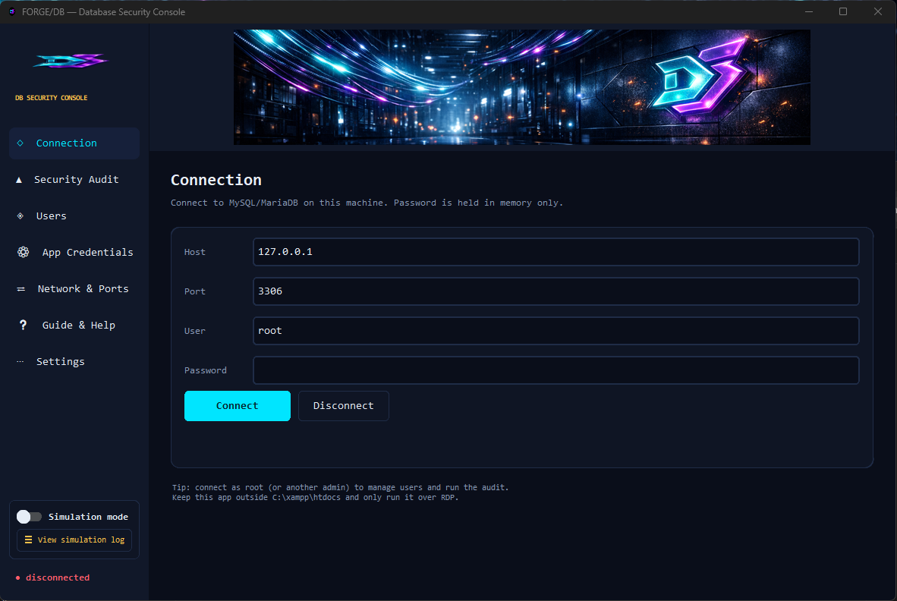
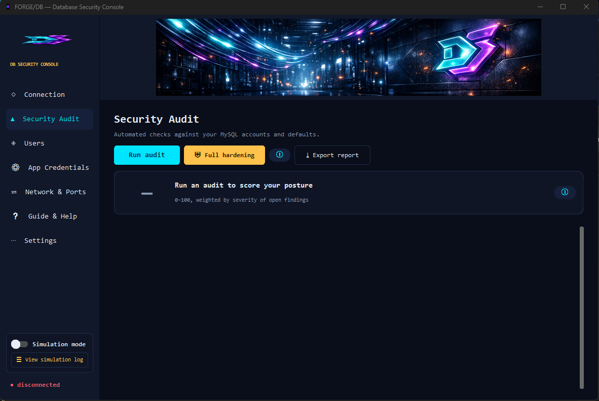
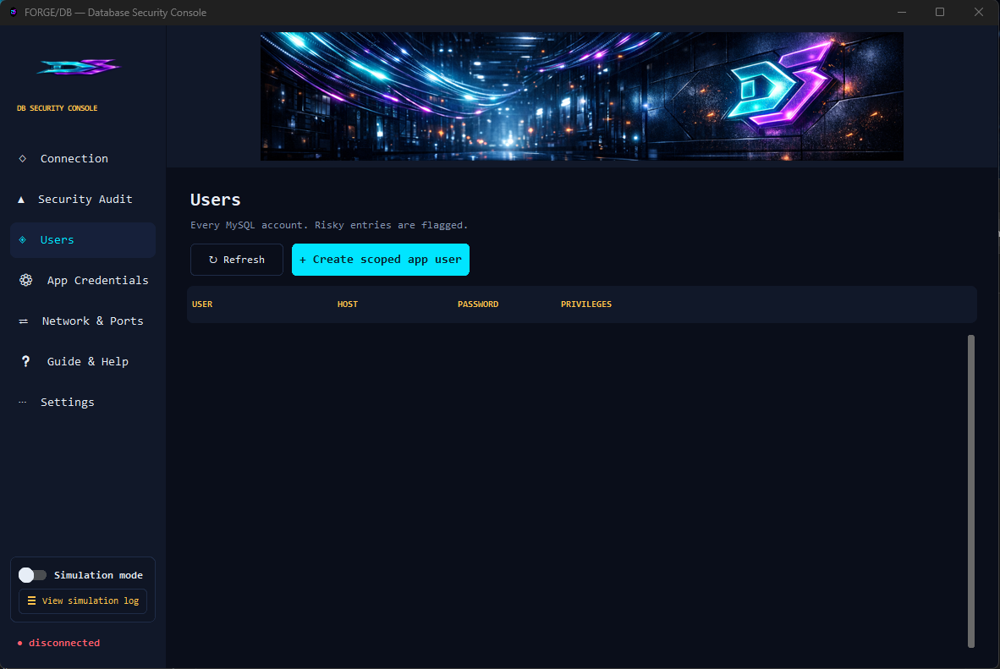
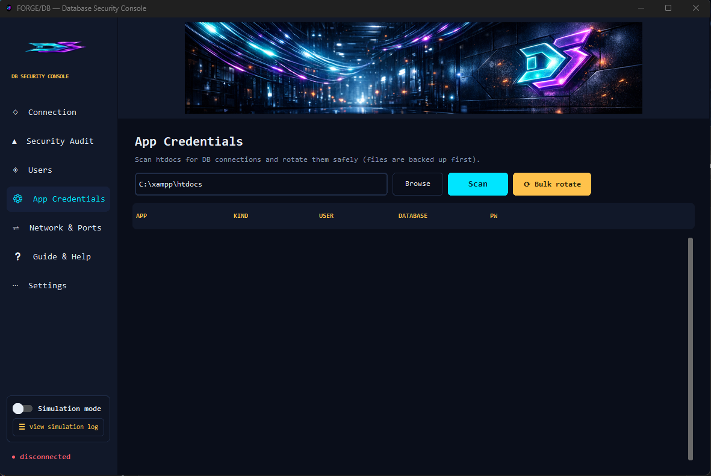
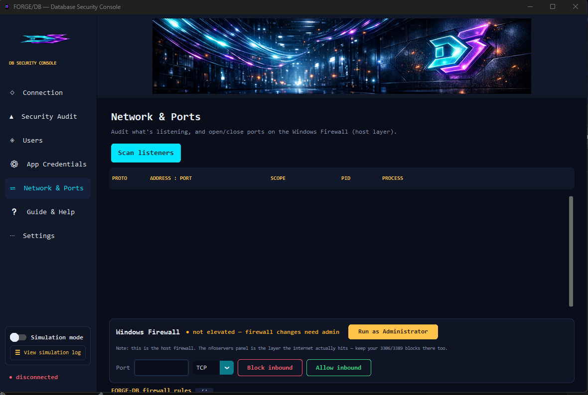
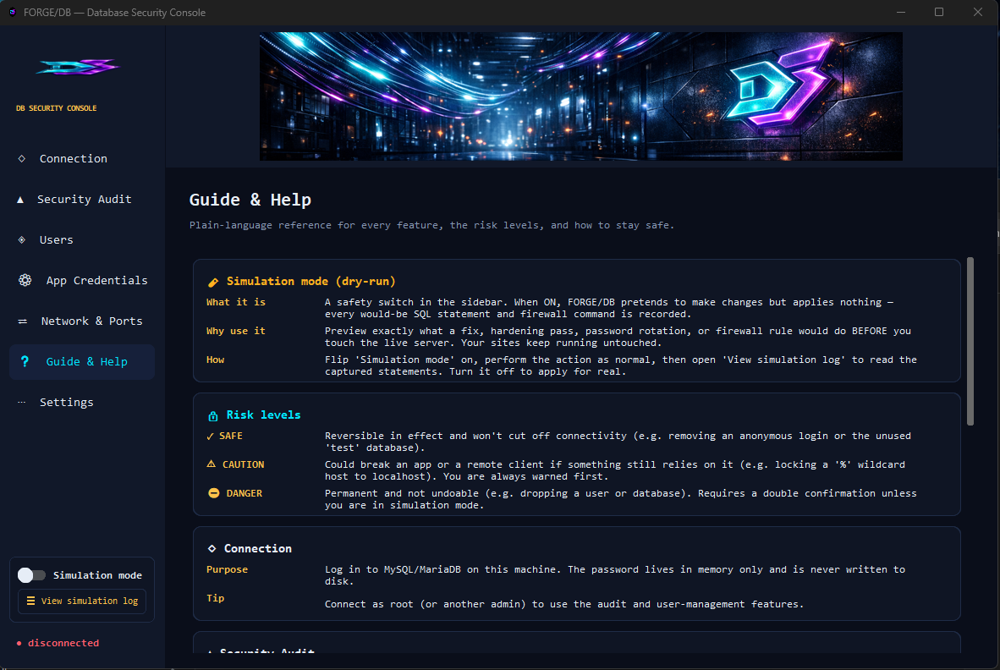
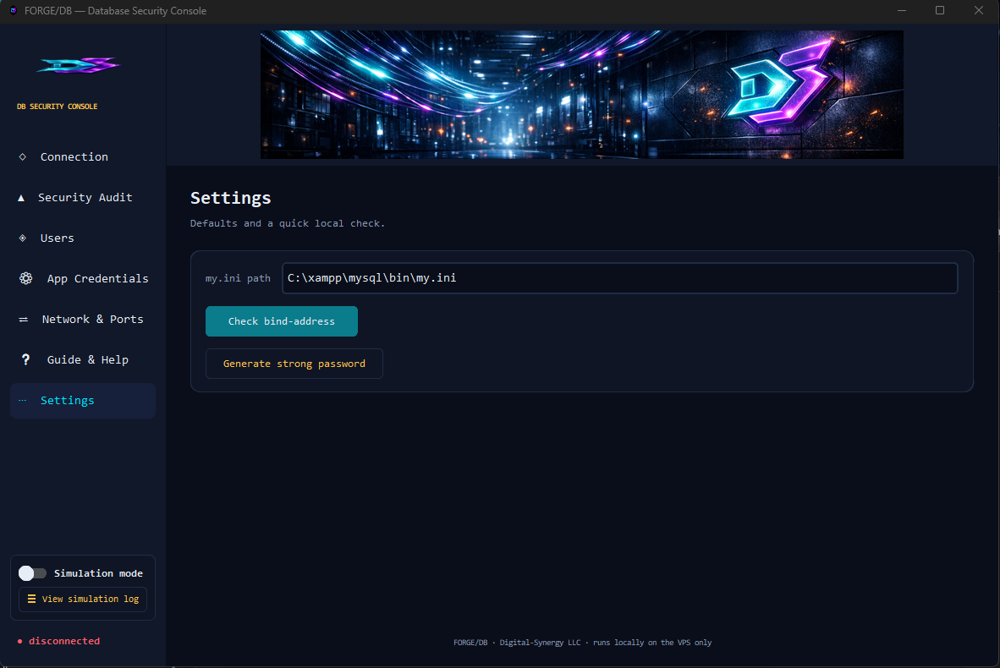

# FORGE/DB — Database Security &amp; Credential Console

> A local desktop tool for hardening and managing **MySQL / MariaDB** on a
> XAMPP Windows VPS, auditing accounts, and safely rotating the database
> credentials your `htdocs` apps use — with a built-in **simulation (dry-run)
> mode** so you can preview every change before it touches the live server.

<sub>Digital-Synergy LLC · Apache License 2.0</sub>

---

## Table of contents

- [FORGE/DB — Database Security \& Credential Console](#forgedb--database-security--credential-console)
  - [Table of contents](#table-of-contents)
  - [What it is](#what-it-is)
  - [Why it exists](#why-it-exists)
  - [Screenshots](#screenshots)
    - [Connection](#connection)
    - [Security Audit](#security-audit)
    - [Users](#users)
    - [App Credentials](#app-credentials)
    - [Network \& Ports](#network--ports)
    - [Guide \& Help](#guide--help)
    - [Settings](#settings)
  - [Feature overview](#feature-overview)
  - [Screens \& what they do](#screens--what-they-do)
  - [Simulation mode (dry-run)](#simulation-mode-dry-run)
  - [Security score](#security-score)
  - [Safety model — “won’t break my sites?”](#safety-model--wont-break-my-sites)
  - [Requirements](#requirements)
  - [Install \& run (from source)](#install--run-from-source)
  - [Build a standalone `.exe`](#build-a-standalone-exe)
  - [Command-line interface (headless)](#command-line-interface-headless)
  - [Files this app creates](#files-this-app-creates)
  - [Project structure](#project-structure)
  - [Security notes — please read](#security-notes--please-read)
  - [Disclaimer](#disclaimer)
  - [License](#license)

---

## What it is

FORGE/DB is a single-file Python desktop application (a dark-themed
[CustomTkinter](https://github.com/TomSchimansky/CustomTkinter) GUI) plus an
optional headless CLI. It is meant to run **locally on the VPS itself**, over
your RDP session, against the MySQL/MariaDB instance that ships with XAMPP.

It does three core jobs:

1. **Audit** your database for common security problems.
2. **Manage** users and rotate credentials with least-privilege defaults.
3. **Harden** the database with a reviewed batch of safe fixes.

Everything that changes state can first be **simulated** — previewed and logged
without being applied — so you can see exactly what would happen.

## Why it exists

A default XAMPP install commonly ships with a passwordless `root`, anonymous
accounts, wildcard `%` hosts, and a leftover `test` database. Apps in `htdocs`
frequently connect as `root` with credentials hard-coded in PHP or `.env`
files. FORGE/DB finds those issues, explains them in plain language, and helps
you fix them **without locking yourself or your sites out**.

---

## Screenshots

### Connection

Connect to MySQL/MariaDB on localhost. Your password is held in memory only and is never written to disk.



### Security Audit

Run a read-only scan, view the 0&ndash;100 security score, and apply individual fixes or a full hardening pass.



### Users

See every account (risky ones flagged), create scoped least-privilege app users, change passwords, lock hosts, or drop accounts.



### App Credentials

Scan `C:\xampp\htdocs` for DB connections in PHP and `.env` files, see which app uses which user/db, and rotate credentials in place (each file is backed up first).



### Network &amp; Ports

Inspect what&rsquo;s listening and manage Windows Firewall rules at the host layer, with guards against blocking your own RDP.



### Guide &amp; Help

Plain-language reference for every feature, the risk levels, simulation mode, and the security score.



### Settings

Application preferences.



---

## Feature overview

| Area | What you get |
|------|--------------|

| **Security Audit** | Flags anonymous users, `%` wildcard hosts, blank/weak passwords, over-privileged app accounts, the leftover `test` DB, and more. |
| **Security Score** | A read-only 0&ndash;100 posture score (grade A&ndash;F) weighted by finding severity. |
| **Users** | List and flag every account; create scoped, least-privilege per-app users; change passwords; lock a host to `localhost`; drop accounts. |
| **App Credentials** | Scan `C:\xampp\htdocs` for DB connections in PHP and `.env` files; see which app uses which user/db; rotate credentials in place (each file is backed up first). |
| **Network &amp; Ports** | List what&rsquo;s listening; add/remove Windows Firewall rules at the host layer. |
| **Simulation mode** | Global dry-run switch — preview &amp; record every change (SQL, firewall, file rewrites) without applying anything. |
| **Guide &amp; Help** | In-app reference explaining each page, the risk levels, the score, and best practices. |
| **Inline explainers** | `ⓘ` buttons and hover tooltips on key controls describe what things are and what they do. |
| **Reports** | Export audit results to timestamped JSON + CSV. |
| **CLI** | Headless `audit`, `scan`, `export`, `harden`, and `doctor` commands for automation. |

---

## Screens &amp; what they do

- **◇ Connection** — Connect to MySQL/MariaDB on localhost. Your password is kept
  **in memory only** and is never written to disk. Connect as `root` (or another
  admin) to use the management features.
- **▲ Security Audit** — Run a read-only scan, view the security score, and apply
  individual fixes or a full hardening pass.
- **◈ Users** — See every account (risky ones flagged), create scoped app users,
  change passwords, lock hosts, or drop accounts.
- **⚙ App Credentials** — Scan `htdocs`, see who uses what, and rotate credentials
  in place. Every file is backed up before it is rewritten.
- **⇄ Network &amp; Ports** — Inspect listeners and manage Windows Firewall rules
  (host layer). Includes guards against accidentally blocking your own RDP.
- **❔ Guide &amp; Help** — Plain-language reference for every feature and risk level.
- **⋯ Settings** — App preferences.

---

## Simulation mode (dry-run)

Flip the **Simulation mode** switch in the sidebar (an amber banner confirms it
is active). While ON:

- Every database write (create/drop user, lock host, change password, hardening)
  is **previewed only** and recorded — nothing is executed.
- Every firewall rule (block/allow/remove) is **recorded** as the exact `netsh`
  command instead of being run.
- Every credential-file rewrite is **recorded** instead of modifying the file.

Open **&ldquo;View simulation log&rdquo;** to read the captured statements, then
**Export** them to `reports/` if you want a record. Turn simulation **off** to
apply changes for real. Read operations (audits, scans, listing users) always
run normally.

This is the recommended way to preview a hardening pass or a bulk credential
rotation before committing to it.

---

## Security score

The Security Audit page shows a simple **0&ndash;100** health number with an
**A&ndash;F** grade. It starts at 100 and subtracts points for each open finding
(roughly 28 for a HIGH, 12 for a MEDIUM, 4 for a LOW). It is **read-only** —
calculating it changes nothing. Fix issues (or preview the fixes in simulation
mode) and re-run the audit to watch it improve.

---

## Safety model — &ldquo;won&rsquo;t break my sites?&rdquo;

FORGE/DB is built to avoid breaking running sites. Key safeguards:

- **Risk levels on every action:**
  - ✓ **SAFE** — reversible in effect and won&rsquo;t cut connectivity
    (e.g. removing an anonymous login or the unused `test` database).
  - ⚠ **CAUTION** — could break an app or remote client if something still
    relies on it (e.g. locking a `%` wildcard host to `localhost`). You are
    warned first.
  - ⛔ **DANGER** — permanent and not undoable (e.g. dropping a user or
    database). Requires a double confirmation (unless you&rsquo;re simulating).
- **Simulation mode** lets you preview anything before applying it.
- **File backups** — every credential file is copied to a timestamped backup
  before it is rewritten, so a bad rotation is easy to undo.
- **Password in memory only** — never persisted to disk.
- **Least-privilege defaults** — the user creator scopes accounts to a single
  database with no `GRANT` option.
- **Lockout guards** — blocking RDP (port 3389) warns you twice.

> Tip: prefer **creating a new scoped user** and updating the app&rsquo;s config
> over dropping an account a live site still uses. After rotating credentials,
> make sure the matching DB account exists with the new password, or the app
> will fail to connect.

---

## Requirements

- **Windows** (uses `netsh`, `netstat`, `tasklist`, UAC elevation, `iconbitmap`).
- **Python 3.10+** (developed on 3.13).
- Python packages (see [`requirements.txt`](requirements.txt)):
  - `customtkinter` — GUI
  - `PyMySQL` — database driver
  - `Pillow` — branding images (optional; the app degrades gracefully without it)
  - `pyinstaller` — only needed to build the `.exe`

---

## Install &amp; run (from source)

```powershell
# from the project folder
py -m venv .venv
.\.venv\Scripts\Activate.ps1
py -m pip install -r requirements.txt

# launch the GUI
py forge_vps_security.py
```

> On machines where `python` is the Microsoft Store alias stub, use the **`py`**
> launcher as shown above.

---

## Build a standalone `.exe`

The repo includes a build controller and a PyInstaller spec that produce a
single windowed executable at `dist\FORGE-DB.exe`.

```powershell
# one-step build (creates the venv, installs deps, runs PyInstaller)
cmd /c controller.bat
```

or directly, if your environment is already set up:

```powershell
py -m PyInstaller --noconfirm forge_vps_security.spec
```

The spec bundles the `assets/` folder and the CustomTkinter theme data, sets the
window icon, and builds in **onefile / windowed** mode (no console).

---

## Command-line interface (headless)

For automation or quick checks without the GUI:

```powershell
py forge_vps_security.py <command> [options]
```

| Command | Description |
|---------|-------------|

| `audit`  | Connect and print security findings. Exits non-zero if any HIGH finding exists. |
| `scan`   | Scan `htdocs` for app DB credentials (no DB connection needed). |
| `export` | Connect, audit, and write a JSON + CSV report. |
| `harden` | Apply the safe remediation batch (`--aggressive` adds CAUTION actions). |
| `doctor` | Check that dependencies are installed. |

**Common options:**

| Option | Default | Notes |
|--------|---------|-------|

| `--host` | `127.0.0.1` | MySQL host. |
| `--port` | `3306` | MySQL port. |
| `--user` | `root` | MySQL user. |
| `--password` | _(prompt)_ | Else the `FORGEDB_PASSWORD` env var, else an interactive prompt. |
| `--htdocs` | `C:\xampp\htdocs` | Folder to scan for app credentials. |
| `--out` | `reports/` | Output path/prefix for `export`. |
| `--aggressive` | off | With `harden`, also apply CAUTION actions (may break apps/remote clients). |
| `--yes` | off | Skip the confirmation prompt for `harden`. |

**Examples:**

```powershell
# verify the environment
py forge_vps_security.py doctor

# scan htdocs for credentials (no DB login required)
py forge_vps_security.py scan

# audit using a password from an environment variable
$env:FORGEDB_PASSWORD = "..."   # set securely; avoid putting secrets in history
py forge_vps_security.py audit

# export a JSON + CSV report
py forge_vps_security.py export --out reports\my-audit
```

> **Security tip:** prefer the interactive prompt or `FORGEDB_PASSWORD` over
> passing `--password` on the command line, since command-line arguments can be
> captured in shell history and process listings.

---

## Files this app creates

These are written **next to the app** and are intentionally excluded from git
via [`.gitignore`](.gitignore):

- `forgedb_config.json` — remembers host / port / last username / htdocs path and
  the simulation-mode preference (never your password).
- `reports/` — exported audit reports (JSON + CSV) and simulation logs.
- `*.forgedbak` / `*.bak` — timestamped backups of credential files before a
  rotation. **These can contain real passwords — never commit them.**

---

## Project structure

```text
forge_vps_security/
├─ forge_vps_security.py      # the entire application (GUI + CLI)
├─ forge_vps_security.spec    # PyInstaller build spec (onefile, windowed)
├─ controller.bat             # one-step build orchestration
├─ requirements.txt           # Python dependencies
├─ assets/
│  └─ img/                     # branding (logo, header, background, icon)
├─ LICENSE                     # Apache License 2.0
├─ NOTICE                      # attribution / third-party notices
└─ .gitignore
```

---

## Security notes — please read

- **Run locally only.** Use FORGE/DB on the VPS over your RDP session.
- **Keep it OUTSIDE `C:\xampp\htdocs`.** Anything in `htdocs` is served to the
  public by Apache. Put the app somewhere like `C:\Tools\`.
- **Host firewall ≠ provider firewall.** The Windows Firewall rules this tool
  manages are the host layer; your VPS provider&rsquo;s edge firewall is separate.
  Keep both tight.
- **Least privilege.** Give each app its own scoped, `GRANT`-less user limited to
  its own database.
- **Preview first.** When in doubt, use simulation mode and export the audit
  report so you have a record.

---

## Disclaimer

This software is provided **&ldquo;AS IS&rdquo;, without warranty of any kind**,
under the terms of the Apache License 2.0. It can drop database users and
databases and modify firewall rules — actions that may interrupt services if
misused. **You are solely responsible** for testing changes (simulation mode is
provided for exactly this purpose), maintaining backups, and verifying that your
sites remain accessible. Use at your own risk. See the [LICENSE](LICENSE) for the
full disclaimer of warranty and limitation of liability.

---

## License

Licensed under the **Apache License, Version 2.0**. See [`LICENSE`](LICENSE) and
[`NOTICE`](NOTICE) for details.

```text
Copyright 2026 Digital-Synergy LLC

Licensed under the Apache License, Version 2.0 (the "License");
you may not use this file except in compliance with the License.
You may obtain a copy of the License at

    http://www.apache.org/licenses/LICENSE-2.0

Unless required by applicable law or agreed to in writing, software
distributed under the License is distributed on an "AS IS" BASIS,
WITHOUT WARRANTIES OR CONDITIONS OF ANY KIND, either express or implied.
```

The **Digital-Synergy** name, logo, and branding images in `assets/img/` are
trademarks/assets of Digital-Synergy LLC and are not covered by the Apache 2.0
license grant.
